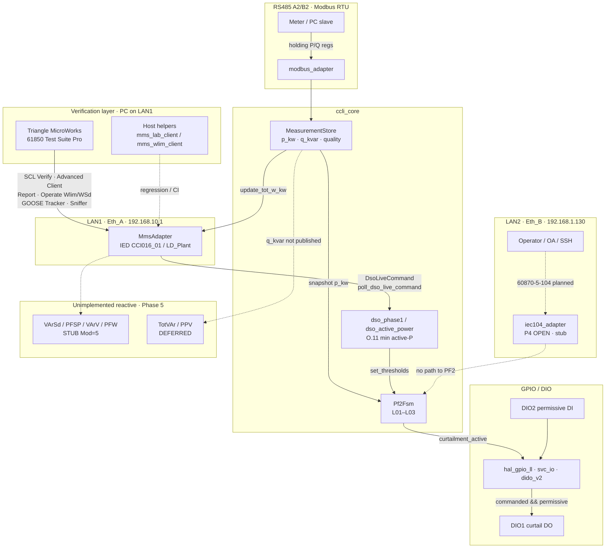
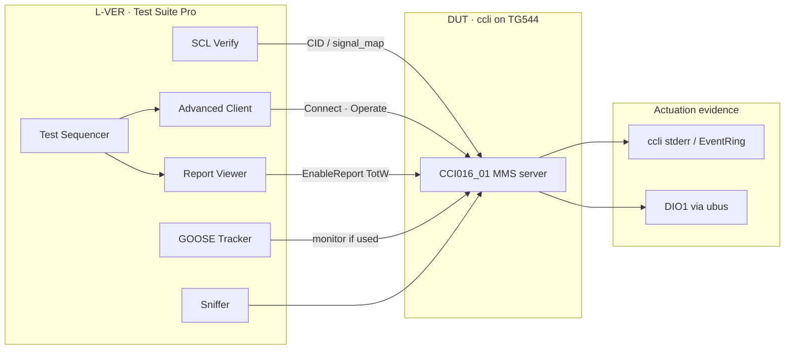
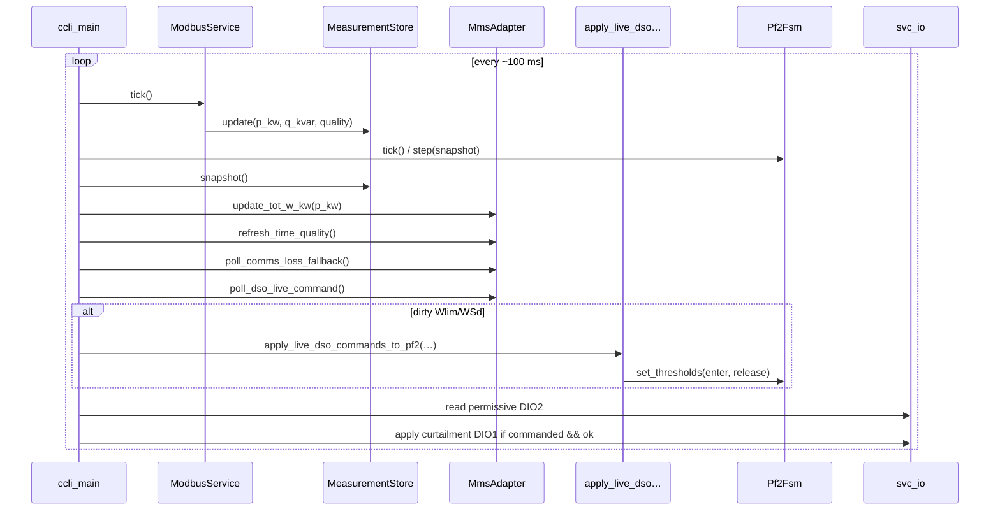

# CCLI — Runtime dataflow architecture

**Document ID:** CCLI-ARCH-RT-DF-001  
**Revision:** 1.1  
**Date:** 2026-09-26  
**Platform:** TesPro TG-524 / TG544 (TR500) · OpenWrt 25.12 · `platform_tg500`  
**Methodology:** `knowledge-base/08-engineering/CCI_Architecture_Framework.md`  
**Companions:** `Architecture/Software_Architecture.md` · **`Architecture/CCI_SW_Architecture_vs_Annex_Validation.md`** · `Architecture/Network_Architecture.drawio` · `lab/CCLI_PHASE_LAB_MASTER_LOG.md` · `apps/ccli/config/icd/signal_map.yaml` · `lab/CCI_Reactive_Roadmap_Gap_Report.md` · **`lab/CCI_TestSuitePro_Verification_Layer.md`**

This document describes **as-built lab runtime** (LAN1/LAN2, MMS, Modbus, MeasurementStore, DSO → PF2 → GPIO) and marks **unimplemented reactive** paths. It does not replace draw.io system diagrams; it is the **software data-path** authority for engineers and RAG.

---

## Requirements

| ID | Requirement |
|----|-------------|
| REQ-NET-001 | DSO traffic on **Eth_A / LAN1** only — no bridge to Eth_B / plant / WAN (O.13.1.1.1) |
| REQ-NET-002 | Operator / OA traffic on **Eth_B / LAN2** — Phase 4 104; not a substitute for Annex T |
| REQ-PF2-001 | Local active-power limitation: measure P → FSM → curtail DO (O.9.2 mode i / lab L01–L03) |
| REQ-PF2-002 | DSO active-P commands on Eth_A: **Wlim** (O.9.2.2) + **WSd** (O.9.2.3) slave PF2 thresholds |
| REQ-PF2-003 | Eth_A comms-loss → clear live Wlim/WSd → Operating Rule autonomous (O.13.1.2 / P3-05) |
| REQ-MET-001 | PdC **TotW** published ≥ every 4 s with `q`/`t` (T.3.1.3 / O.8.3) |
| REQ-MET-002 | PdC **TotVAr** + **PPV** mandatory (T.3.1.3) — **Phase 5-M** (not yet in runtime) |
| REQ-IO-001 | DIO1 = curtail DO; DIO2 = permissive DI; actuation gated `commanded && permissive` |
| REQ-SEC-001 | MMS on Eth_A with TLS / 62351-8 roles (lab: DSO_OPERATOR vs VIEWER) |
| REQ-PH-006 | Reactive O.9.1 + TotVAr owned by **Phase 5** (P5-M / P5-R) — see gap report |
| REQ-VER-001 | **Triangle MicroWorks 61850 Test Suite Pro** is the lab **IEC 61850 verification layer** on Eth_A (SCL / MMS / Report / GOOSE); Host `mms_*` clients remain regression helpers only |

---

## Architecture

### Functional

```text
                    ┌─────────────────────────────────────────┐
                    │              ccli (orchestrator)          │
                    │         services/ccli_main.cpp (~100 ms) │
                    └───────┬───────────┬───────────┬─────────┘
           Modbus tick      │  MMS poll │  PF2 tick │  IO apply
                            ▼           ▼           ▼
              MeasurementStore     DsoLiveCommand   Pf2Fsm
                    │                   │              │
                    ▼                   ▼              ▼
              TotW (MMS MX)     apply_live_dso…    DIO1 DO
```

### Hardware (lab DUT)

| Block | Role | Notes |
|-------|------|-------|
| TG544 / TR500 | CCI host | MT798X, TesproOS / OpenWrt 25.12 |
| LAN1 PHY | Eth_A DSO | `192.168.10.1/24` zone `lan1_sec` |
| LAN2 PHY | Eth_B / OA | `192.168.1.130/24` zone `lan_sec` |
| RS485 A2/B2 | Meter Modbus RTU | `/dev/ttyS2` (lab) |
| GD32 + `dido_v2` | DIO1–DIO4 | Not SoC libgpiod |

### Network (lab as-built)

| Port | CEI role | Linux / zone | CCI address | Traffic |
|------|----------|--------------|-------------|---------|
| **LAN1** | **Eth_A** DSO | `lan1` / `lan1_sec` | **192.168.10.1/24** | IEC 61850 MMS (+ TLS) |
| **LAN2** | **Eth_B** OA | `lan2` / `lan_sec` | **192.168.1.130/24** | SSH/LuCI lab · **104 planned P4** |
| LAN3 | Plant | `lan3` / `lan2_sec` | 192.168.30.1/24 | Plant LAN (isolated) |
| ENG | Local config | `br-lan` | 192.168.0.1/24 | Engineering |

**Sources:** `lab/CCLI_PHASE_LAB_MASTER_LOG.md` § ports · `Architecture/Zones_62443_TG544_PortMap.drawio` · CID `apps/ccli/config/icd/lab_tg544_eth_a.cid`.

### Security

| Path | Control |
|------|---------|
| Eth_A MMS | TLS 1.2+ · ACSE cert auth · RBAC DSO_OPERATOR write / VIEWER deny · CRL lab |
| Eth_B | No MMS listen; P4 104 + 62351-3/5 when enabled |
| Isolation | P2 closed — no L2 bridge Eth_A ↔ Eth_B ↔ plant ↔ WAN |

### Power

12–36 V product PSU · lab UPS DRC-60A (see `Power_Tree.drawio` / TR400 lab platform). Not on the software data path.

---

## End-to-end flow diagram



### Verification layer placement


### Main-loop sequence (source of truth)



---

## Path detail · source files

### 1. LAN1 communications (Eth_A / DSO)

| Item | Value / file |
|------|----------------|
| Role | CEI **Eth_A** — DSO |
| Lab IP | `192.168.10.1/24` |
| Bind | `mms.bind_address` in yaml · `MmsAdapter::start` |
| CID | `apps/ccli/config/icd/lab_tg544_eth_a.cid` |
| Object map | `apps/ccli/config/icd/signal_map.yaml` |
| Port table | `lab/CCLI_PHASE_LAB_MASTER_LOG.md` |
| Zones | `Architecture/Zones_62443_TG544_PortMap.drawio` |
| **Verification client** | **Triangle MicroWorks 61850 Test Suite Pro** on LAN1 · `lab/CCI_TestSuitePro_Verification_Layer.md` |

### 2. LAN2 communications (Eth_B / OA)

| Item | Value / file |
|------|----------------|
| Role | CEI **Eth_B** — Operatore Abilitato |
| Lab IP | `192.168.1.130/24` (OA SSH/LuCI today) |
| Runtime MMS | **None** on LAN2 |
| Phase 4 | IEC 60870-5-104 — checklist P4-01…05 **OPEN** |
| Stub | `apps/ccli/adapters/iec60870_104/iec104_adapter.*` |
| Config roles | `apps/ccli/config/lab_tr400.yaml` `interfaces.eth_b` |

### 3. MMS path

```text
DSO Operate
  → libiec61850 IedServer (Eth_A)
  → MmsAdapter::on_control(ControlAction)   # discriminate Wlim vs WSd
  → DsoLiveCommand { wlim_*, wsd_* }
  → poll_dso_live_command
  → apply_live_dso_commands_to_pf2
  → Pf2Fsm::set_thresholds

MeasurementStore.p_kw
  → MmsAdapter::update_tot_w_kw
  → PdCMMXU1.TotW mag/t/q + urcb_PdC_Mis4sec (4 s)
```

| File | Role |
|------|------|
| `apps/ccli/adapters/iec61850_mms/mms_adapter.hpp` | `DsoLiveCommand`, public API |
| `apps/ccli/adapters/iec61850_mms/mms_adapter.cpp` | Model CCI016_01/LD_Plant, handlers, TotW, GNSS/chrony Q |
| `apps/ccli/adapters/iec61850_mms/gnss_time.*` | Time offset / chrony sock |
| `apps/ccli/services/svc_mms.hpp` | Thin façade |
| `apps/ccli/third_party/libiec61850/` | Stack |

**LN status:** WlimDWMX1 + WSdDAGC1 **IMPL** · PdC TotW **IMPL** · reactive LNs **STUB** · TotVAr **DEFERRED**.

### 4. Modbus path

```text
Meter (RTU slave)
  → /dev/ttyS2 (A2/B2) or lab USB
  → modbus_adapter::tick
  → Measurement { p_kw, q_kvar, quality, timestamp }
  → MeasurementStore::update
```

| File | Role |
|------|------|
| `apps/ccli/adapters/modbus_master/modbus_adapter.*` | RTU / simulator poll |
| `apps/ccli/services/svc_modbus.hpp` | Façade |
| `apps/ccli/config/lab_tr400.yaml` | `modbus.device`, regs, `poll_ms` |
| `lab/TR400_HW_IO_CONFIG.md` | A2/B2 ↔ tty map |

### 5. MeasurementStore

| Field | Source | Consumers |
|-------|--------|-----------|
| `p_kw` | Modbus | Pf2Fsm, MMS TotW |
| `q_kvar` | Modbus | **stored only** — not MMS TotVAr yet |
| `quality` / `timestamp_ms` | Adapter | Pf2 stale (L03), UI |

| File | Role |
|------|------|
| `apps/ccli/core/measurement/measurement_store.hpp` | Struct + store |
| `apps/ccli/core/measurement/measurement_store.cpp` | update / snapshot |

### 6. DSO command path (active P)

| Step | Clause | Code |
|------|--------|------|
| Wlim Mod / WMaxSptPct | O.9.2.2 · T Table 85 | `mms_adapter.cpp` → `live.wlim_*` |
| WSd Mod / WSptPct | O.9.2.3 · T Table 86 | `live.wsd_*` |
| O.11 min() | O.11 | `dso_active_power.cpp` `derive_active_power_kw` |
| Overlay → PF2 kW | — | `dso_phase1.cpp` `apply_live_dso_commands_to_pf2` |
| Yaml / TR mock | O.8.2 / TR Figura 2 | `apply_dso_to_pf2_config`, `lab_tr400_dso_tr57126.yaml` |
| Comms-loss clear | O.13.1.2 | `poll_comms_loss_fallback` |

Orchestration: `apps/ccli/services/ccli_main.cpp` (MMS poll block).

### 7. PF2 FSM

| Item | Detail |
|------|--------|
| States | Normal → CurtailPending → CurtailActive · SafeState on stale |
| Enter | `P > threshold_kw` + debounce (L01) |
| Release | `P < release_threshold_kw` (L02) |
| Stale | meter age > `stale_data_s` → SafeState, curtail off (L03) |
| Files | `apps/ccli/core/pf2/pf2_fsm.hpp` · `pf2_fsm.cpp` · `services/svc_pf2.*` |

Thresholds come from yaml **or** live DSO overlay (not from GPIO).

### 8. GPIO actuation

```text
Pf2Fsm::curtailment_active()
  AND  DIO2 permissive (or permissive_bypass lab only)
  → svc_io_apply_curtailment(true/false)
  → hal_gpio_ll / ubus dido_v2
  → DIO1 relay (curtail)
```

| File | Role |
|------|------|
| `apps/ccli/services/svc_io.c` · `svc_io.h` | Curtail + permissive API |
| `apps/ccli/platform/platform_tg500/hal_gpio_ll.c` | TG544 HAL |
| `apps/ccli/adapters/io/drv_gpio.*` | Driver glue |
| `apps/ccli/config/lab_tr400.yaml` `io:` | ch1 DO / ch2 DI |

### 9. Unimplemented reactive functions

| Figura / LN | Clause | Status | Gate |
|-------------|--------|--------|------|
| `PdCMMXU1.TotVAr` | T.3.1.3 · O.8.3 | **DEFERRED** (q_kvar HAVE, not published) | **P5-M07** |
| `PdCMMXU1.PPV` | T.3.1.3 | **DEFERRED** | **P5-M08** |
| `VArSdDVAR1` | O.9.1.4 · T Table 88 | **STUB** Mod=5 | **P5-R01** |
| `PFSPDFPF1` | O.9.1.1 · T Table 90 | **STUB** | **P5-R02** |
| `VArVDVVR1` | O.9.1.3 · T Table 91 | **STUB** | **P5-R03** |
| `PFWDPFW1` | O.9.1.2 · T Table 92 | **STUB** | **P5-R04** |
| `VArSa` MSD | O.10.3.2 · T Table 89 | Not in model | **P5-R08** |
| O.11 Q tier / TsQ | O.11 · O.7.3.1 | Not in arbiter | **P5-R05/R07** |
| Plant Q actuator | — | **MISSING** (DIO1 = P only) | P5-R blocker |

**Authority:** `lab/CCI_Reactive_Roadmap_Gap_Report.md` · checklist Phase 5 (rev 1.2).

---

## Interface matrix

| Interface | Source | Destination | Protocol |
|-----------|--------|-------------|----------|
| Eth_A / LAN1 | **Test Suite Pro** (verification) | `MmsAdapter` | IEC 61850-8-1 MMS (+ TLS) |
| Eth_A / LAN1 | DSO / host `mms_*` (helpers) | `MmsAdapter` | same |
| Eth_A / LAN1 | `MmsAdapter` TotW | Test Suite Pro Report Viewer | URCB / integrity 4 s |
| Eth_A / LAN1 | Test Suite Pro Sniffer | Wire capture | MMS / GOOSE frames |
| Eth_B / LAN2 | OA (planned) | `iec104_adapter` | IEC 60870-5-104 (P4) |
| RS485 | Meter | `modbus_adapter` | Modbus RTU |
| In-process | Modbus | `MeasurementStore` | C++ API |
| In-process | MMS live cmd | `dso_phase1` → `Pf2Fsm` | `DsoLiveCommand` |
| In-process | `MeasurementStore` | `Pf2Fsm` | snapshot |
| DIO2 | External permit | `svc_io` | Dry contact / GD32 DI |
| DIO1 | `svc_io` | Plant curtail relay | DO via `dido_v2` |

---

## BOM matrix (runtime-relevant)

| Block | Function | Candidate / PN | Status |
|-------|----------|----------------|--------|
| Host | CCI gateway | TesPro TG-524 / TG544 TR500 | Lab DUT |
| Eth domains | LAN1–3 + ENG | On-board RJ45 | P2 isolation CLOSED |
| MMS stack | Eth_A server | libiec61850 (in-tree) | IMPL |
| **61850 lab client** | **Verification layer** | **Triangle MicroWorks 61850 Test Suite Pro** | **REQ-VER-001** |
| Host MMS helpers | CI / quick regress | `lab/mms_*_client` | Secondary |
| 104 stack | Eth_B | lib60870 | P4 OPEN / stub |
| Meter | P/Q | Lab float slave / product analyzer | P5 map OPEN |
| DIO | Curtail + permit | GD32 `dido_v2` | IMPL lab |
| GNSS / time | ±100 ms | Modem NMEA + chrony | P3-11 PASS lab |

---

## Knowledge gaps

| Area | Current | Required | Gap |
|------|---------|----------|-----|
| TotVAr / PPV MMS | TotW only | T.3.1.3 mandatory set | P5-M |
| Plant Q path | None | Inverter/API for O.9.1 | **MISSING** |
| LAN2 104 | Stub | P4 session + 62351 | OPEN |
| Product CID | TR example + lab Eth_A CID | Plant-specific | Model |
| Analyzer regs | Lab 40001 P (+ Q reg) | Datasheet map | P5-06 |
| Test Suite Pro license / NIC | Trial on engineer PC | Named lab seat · Eth_A NIC | Procure / renew |
| GOOSE in product | Not used in P3 MVP | If plant GOOSE later | Tracker N/A until model |

**Corpus HAVE:** `CCI_Annex_O_Extract.md`, `CCI_Annex_T_Extract.md`, `CCI_Phase_Regulation_Checklists.md`.  
**Corpus MISSING:** plant Q interface spec (commercial/HW).

---

## Risks

| ID | Description | Impact | Mitigation |
|----|-------------|--------|------------|
| R-DF-01 | Claim CEI PF2 complete without TotVAr / O.9.1 | Cert / DSO reject | Phase 5 gates; gap report |
| R-DF-02 | MMS on wrong bridge / LAN2 | Invalid Eth_A evidence | Bind `192.168.10.1`; P2 isolation |
| R-DF-03 | `permissive_bypass: true` in product | Uninterlocked DO | Config audit P7-12 |
| R-DF-04 | Operate VArSd with no plant Q | False compliance | P5-R01 requires path or GAP |
| R-DF-05 | q_kvar unread / unpublished | Silent metrology hole | P5-M07 |
| R-DF-06 | Only host `mms_*` used as “DSO proof” | Weak vs commercial client | Prefer Test Suite Pro evidence packs |
| R-DF-07 | Test Suite Pro on wrong NIC / LAN2 | False Eth_A tests | Bind PC to 192.168.10.0/24 |

---

## Verification

**Primary Eth_A client:** Triangle MicroWorks **61850 Test Suite Pro** — procedure map `lab/CCI_TestSuitePro_Verification_Layer.md`.  
**Secondary:** `lab/tg544-openwrt/mms_lab_client` · `mms_wlim_client` (libiec61850 host builds).

| Requirement | Test | Pass criteria |
|-------------|------|---------------|
| REQ-NET-001 | P2 isolation suite | No ping Eth_A ↔ Eth_B / WAN |
| REQ-PF2-001 | Phase 1 lab / `--lab-demo` | DIO1 follows P vs threshold |
| REQ-PF2-002 | **Test Suite Pro** Operate `WlimDWMX1` / `WSdDAGC1` | Report/Data Monitor + DUT log `mms→pf2:` |
| REQ-PF2-003 | Disconnect clients > fallback_s | Live Wlim/WSd cleared; Mod=5 |
| REQ-MET-001 | Test Suite Pro **Report** / polled TotW | Period ~4 s (intgPd=4000) |
| REQ-MET-002 | P5-M07 + Report TotVAr | TotVAr on wire from `q_kvar` |
| REQ-VER-001 | SCL Verify vs `lab_tg544_eth_a.cid` / `signal_map.yaml` | Model browse matches freeze |
| REQ-IO-001 | Permissive open during Operate | Curtail commanded but DO off + event |
| Unit | `dso_phase1_test` | 42 kW Figura 2; O.11 min; live WSd |

### Test Suite Pro tool → CCLI gate

| Test Suite Pro tool | CCLI path | Gate / use |
|---------------------|-----------|------------|
| **SCL Verify** / SCL Viewer | CID + dynamic model | P3 model · P5 LN adds |
| **Advanced Client** | MMS Connect / Operate / Read | P3-04 Wlim/WSd · P5-R Operate |
| **Report** (EnableReport) | `urcb_PdC_Mis4sec` TotW | P3-03 · P5-M07 TotVAr |
| **Data Monitor** / Server Data | Live DO values | Threshold / Mod stVal |
| **GOOSE Tracker** | Plant GOOSE (if enabled) | N/A until GOOSE in model |
| **Test Sequencer** | Scripted Connect→Operate→Report | Repeatable evidence packs |
| **Sniffer** | Wire MMS/GOOSE | TLS vs cleartext · timing |
| **Compare Model** | Offline vs online | CID drift check |

Do **not** confuse **Test Suite Pro** (Triangle MicroWorks client) with **TesPro** (TG544 hardware OEM).

---

## SW tree (runtime)

```text
apps/ccli/
  services/ccli_main.cpp          orchestrator loop
  services/svc_{mms,modbus,pf2,io}.*
  adapters/iec61850_mms/          LAN1 MMS
  adapters/modbus_master/         RS485 meter
  adapters/iec60870_104/          LAN2 stub (P4)
  adapters/io/                    GPIO glue
  core/measurement/               MeasurementStore
  core/dso/                       O.8.2 / O.9.2 / O.11 active-P
  core/pf2/                       Pf2Fsm
  platform/platform_tg500/        HAL
  config/icd/signal_map.yaml      LN freeze
```

---

## Document history

| Rev | Date | Change |
|-----|------|--------|
| 1.1 | 2026-09-26 | Add Triangle MicroWorks Test Suite Pro as Eth_A verification layer (REQ-VER-001) |
| 1.0 | 2026-09-26 | Initial runtime dataflow: LAN1/2, MMS, Modbus, store, DSO, PF2, GPIO, reactive gaps |
