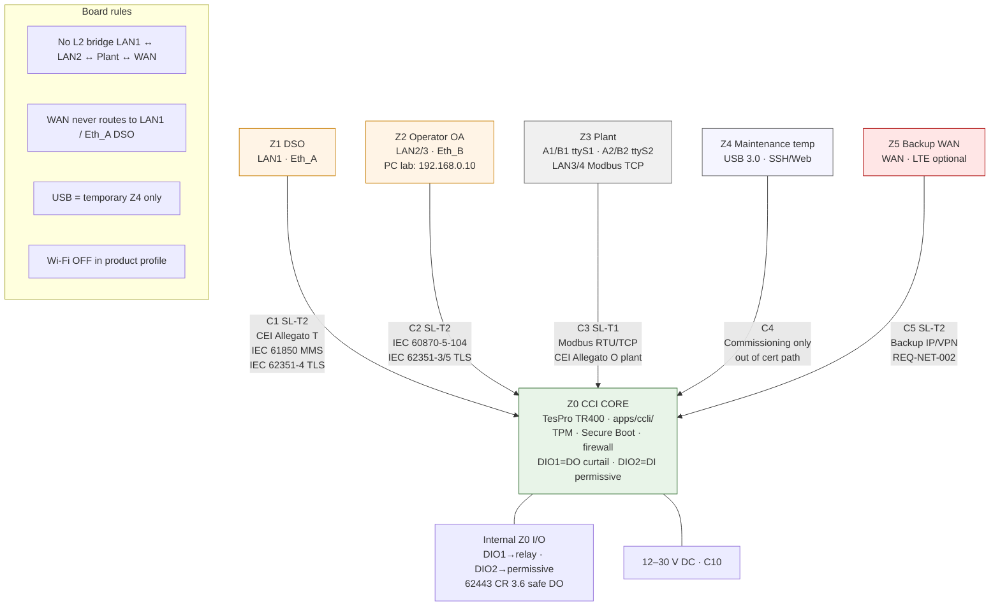
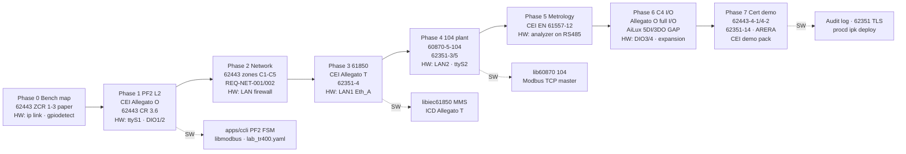
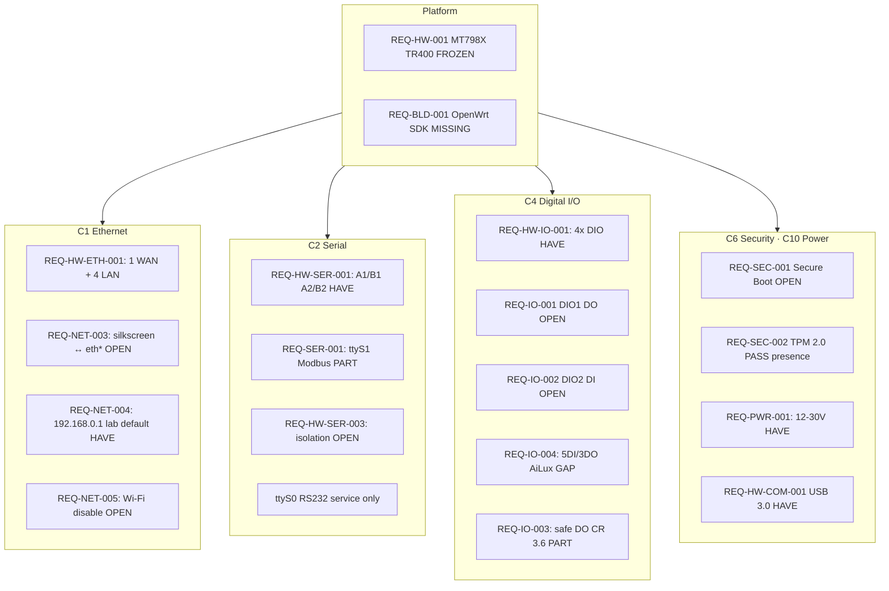
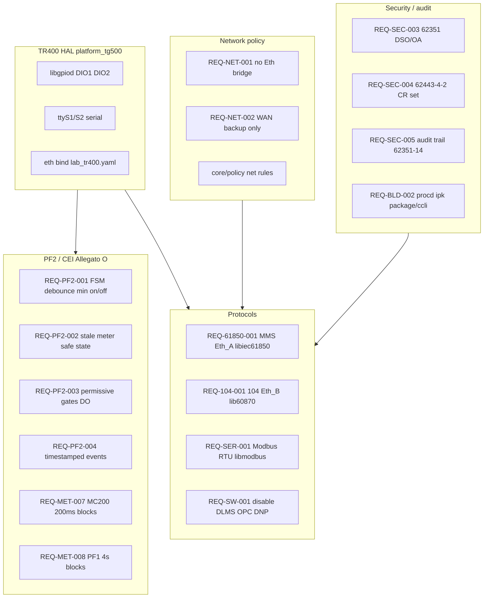
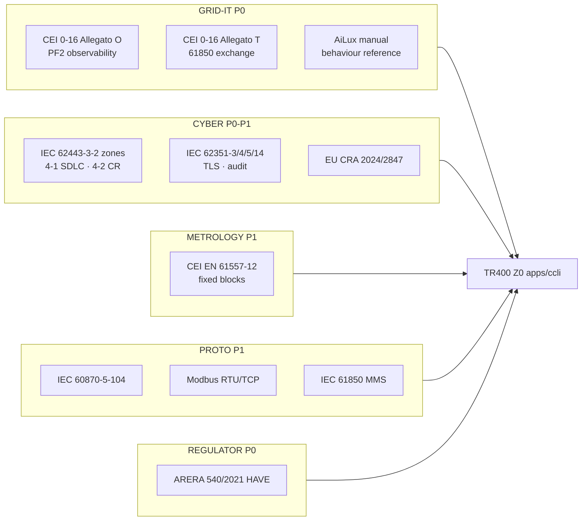

# IEC 62443-3-2 — CCLI Zone & Conduit Architecture (TR400 / TG-524)

**Document ID:** CCLI-SEC-62443-001  
**Revision:** 1.7  
**Date:** 2026-09-25  
**RAG source_id:** `ccli-62443-zones-extract`  
**Normative basis:** IEC 62443-3-2:2020 — *Security risk assessment for system design* (ZCR 1–7)  
**Capture status:** **PART** — pp. 7, 11–17, 18–27 (+ Annex A/B start) from screenshot extract; licensed PDF target `iec-62443-3-2`  
**Normative reference (3-2 §2):** IEC 62443-3-3:2013 — system security requirements and security levels  
**Programme link:** K6.4 · K3.3 · K6.3 · `ccli-tg500-lab-platform` · `ccli-tr400-user-manual-extract` · `ccli-cci-module-regs-class`  
**Config anchor:** `apps/ccli/config/lab_tr400.yaml`  
**Port-map diagram (signed P2-05):** `Architecture/Zones_62443_TG544_PortMap.drawio`  
**Lab evidence:** `lab/evidence/O13_1_isolation_2026-09-25/P2_01_CROSS_PING_MATRIX.txt`

---

## Summary

This document applies **IEC 62443-3-2** zone/conduit partitioning (**ZCR 3**) and risk workflow (**ZCR 1–2, 4–6**) to the **HiTEKS CCLI** on **TesPro TR400** (active lab DUT) / **TG-524** (product SKU) — OpenWrt / TesproOS / MT798X. It is the engineering baseline for **K6.4** until a formal asset-owner sign-off (**ZCR 7**) in the certification phase.

**Rev 1.2** adds **TR400 physical pin-out ↔ zone/conduit** mapping (§TR400 zone pin-out). **Rev 1.3** adds **Mermaid one-board diagrams** (§Mermaid). **Rev 1.5** adds **TG544 Phase 2 lab as-built port ↔ zone binding** (§TG544 Phase 2 lab as-built) and **engineering sign-off for P2-05** (ZCR 3+6). Linux DIO GPIO lines remain **OPEN** until `gpiodetect` / `gpioinfo` freeze.

**Proposed target:** **SL-T = 2** for zones Z0–Z2 and conduits C1–C2 (validate with accredited lab before contract). **SL-T = 1** for plant conduit C3. Rationale: Annex A SL 2 covers intentional violation with *simple means, low resources, generic skills* — appropriate for grid-connected CCI; plant Modbus is lower exposure.

Detailed FR/SR mapping uses **IEC 62443-3-3** (SL-C selection, **HAVE** in `ccli-62443-3-3-extract`) + **62443-4-2** (component proof — not yet in corpus).

---

## Normative scope (§1) and terms (§3)

**62443-3-2 scope** requires the organization to:

1. Define the **SUC** and its security perimeter  
2. Partition the SUC into **zones and conduits**  
3. Assess risk for **each zone and conduit**  
4. Establish **SL-T** for each zone and conduit  
5. Document security requirements in a **CRS**  
6. Obtain **asset owner approval** (ZCR 7)

| Term | Definition (3-2) | CCLI usage |
|------|------------------|------------|
| **SUC** | System under consideration — assets for one automation solution | TR400/TG-524 CCI + connected DSO/operator/plant paths |
| **Zone** | Grouping of assets with common security requirements | Z0–Z5 (see below) |
| **Conduit** | Logical/physical channel between zones | C1–C5 |
| **Channel** | Specific logical or physical link between assets | Each AP (Eth_A, RS485, USB, …) |
| **SL-T** | Target security level from risk assessment | SL 2 (Z0, Z1, Z2, C1, C2); SL 1 (C3) |
| **SL-A** | Achieved SL after design / in operation | Measured at cert + ops audit |
| **SL-C** | Capability SL of a component natively | TR400/TG-524 + OpenWrt + CCLI app — needs 3-3/4-2 map |
| **ZCR** | Zone and conduit requirement | Steps 1–7 in this doc |
| **CRS** | Cyber security requirements specification | This document (draft) |
| **Compliance authority** | Entity judging adequacy (regulator, auditor) | DSO + accredited lab at cert gate |

---

## Requirements

| ID | Requirement | 62443-3-2 basis | Status |
|----|-------------|-----------------|--------|
| REQ-SEC-ZC-001 | Identify **SUC** perimeter and all access points | ZCR 1 (§4.2) | PART — this doc |
| REQ-SEC-ZC-002 | Initial cyber risk assessment for mission-critical disruption | ZCR 2 (§4.3) | PART — workshop TBD |
| REQ-SEC-ZC-003 | Partition SUC into **zones and conduits** by risk/criticality | ZCR 3 (§4.4) | PART — diagram below |
| REQ-SEC-ZC-004 | Separate **business/enterprise** from IACS paths | ZCR 3.2 (§4.4.3) | HAVE — no IT bridge to Eth_A |
| REQ-SEC-ZC-005 | Separate **temporary** devices (USB maint.) from permanent IACS | ZCR 3.4 (§4.4.5) | PART — USB console policy TBD |
| REQ-SEC-ZC-006 | Separate **wireless** (Wi‑Fi/LTE) from wired DSO/plant | ZCR 3.5–3.6 (§4.4.6–7) | PART — Wi‑Fi disabled; LTE isolated |
| REQ-SEC-ZC-007 | Compare initial risk to tolerable risk; detailed assessment if exceeded | ZCR 4–5 (§4.5–4.6) | PART |
| REQ-SEC-ZC-008 | Determine **SL-T** per zone/conduit | ZCR 5.6 (§4.6.7) | PART — SL-T 2 proposed |
| REQ-SEC-ZC-009 | Document CRS: assumptions, zone drawings, threats, regulations | ZCR 6 (§4.7) | PART — this doc |
| REQ-SEC-ZC-010 | Asset owner approval | ZCR 7 (§4.8) | MISS — DSO/integrator phase |

---

## Architecture — SUC (ZCR 1)

### System Under Consideration

| Element | In SUC? | Notes |
|---------|---------|-------|
| **TR400 / TG-524 CCI** (TesproOS + `apps/ccli/`) | Yes | Core asset — TR400 on bench |
| **POC measurement chain** (analyzer + CT/VT via Modbus) | Yes | Data into CCI; physical devices may sit in plant zone |
| **DSO-facing exchange** (61850 / 104 on Eth_A) | Yes | External access point |
| **Operator / qualified operator** (Eth_B) | Yes | External access point |
| **DER / plant field devices** (RS485 / plant LAN) | Yes | Plant zone |
| **Enterprise IT / office LAN** | No | Explicitly out of SUC — no L2 bridge |
| **Vendor cloud / TesPro remote** | No | Unless contracted — treat as external zone |

### Access points (perimeter) — TR400 silkscreen

| AP | TR400 pin | Linux (provisional) | Zone | Protocol | Direction |
|----|-----------|---------------------|------|----------|-----------|
| AP-1 | **LAN1** (Eth_A) | `eth?` **TBD** | Z1↔Z0 | IEC 61850 MMS, (GOOSE) | DSO ↔ CCI |
| AP-2 | **LAN2** or **LAN3** (Eth_B) | `eth?` **TBD** | Z2↔Z0 | IEC 60870-5-104, 61850 client | Operator ↔ CCI |
| AP-3a | **A1/B1** RS485-1 | **`/dev/ttyS1`** | Z3↔Z0 | Modbus RTU | Plant ↔ CCI |
| AP-3b | **A2/B2** RS485-2 | **`/dev/ttyS2`** | Z3↔Z0 | Modbus RTU | Plant ↔ CCI |
| AP-3c | **LAN3 / LAN4** | `eth?` **TBD** | Z3↔Z0 | Modbus TCP | Plant ↔ CCI |
| AP-4 | **USB 3.0** | `usb*` | Z4↔Z0 | SSH / HTTPS console | Maintainer → CCI |
| AP-5 | **WAN** (+ LTE if fitted) | `eth?` **TBD** | Z5↔Z0 | IP / VPN (backup) | External → CCI |
| AP-6 | **Wi‑Fi** | wlan* | — | **Disabled** in product profile | N/A |
| — | **RXD/TXD/GND** RS232 | **`/dev/ttyS0`** | — | Service / debug | Out of cert path |
| — | **DIO1–DIO4** (internal Z0) | gpio **TBD** | Z0 | PF2 DO/DI | Not external zones |

---

## Architecture — Zones & conduits (ZCR 3)

### Zone model (aligned with REQ-NET-001)

```
                    ┌─────────────────────────────────────┐
  Zone Z1: DSO      │  Eth_A — IEC 61850 MMS server       │
  (high trust ext)  │  TR400 LAN1 (eth? TBD)              │
                    └──────────────┬──────────────────────┘
                                   │ Conduit C1 (SL-T 2)
                    ┌──────────────▼──────────────────────┐
  Zone Z0: CCI      │  TR400 — apps/ccli/                 │
  (IACS component)  │  DIO1 DO · DIO2 DI · TPM · firewall │
                    └──┬────────┬──────────┬──────────┬───┘
                       │ C2     │ C3       │ C4       │ C5
         ┌─────────────▼──┐ ┌───▼──────────────┐ ┌─────▼────┐ ┌──▼──────────┐
  Zone Z2: Operator      │ │ Zone Z3: Plant   │ │ Zone Z4  │ │ Zone Z5     │
  LAN2/3 — 104           │ │ A1/B1 ttyS1      │ │ USB 3.0  │ │ WAN / LTE   │
  (PC on LAN2 lab)       │ │ A2/B2 ttyS2      │ │ (temp)   │ │ (backup)    │
                         │ │ LAN3/4 Modbus TCP│ │          │ │ no→Eth_A    │
                         │ └──────────────────┘ └──────────┘ └─────────────┘
```

### Zone table

| Zone | Name | Assets | Trust | SL-T (proposed) |
|------|------|--------|-------|-----------------|
| **Z0** | CCI core | TR400, CCLI firmware, TPM, **DIO1–4** | Highest internal | **SL 2** |
| **Z1** | DSO | DSO head-end, remote clients | External high | **SL 2** (conduit) |
| **Z2** | Operator | Qualified operator SCADA | External medium | **SL 2** (conduit) |
| **Z3** | Plant | Analyzers, inverters, RTU | Field lower | **SL 1** (conduit) |
| **Z4** | Maintenance | USB console laptop | Temporary | **Separate** per ZCR 3.4 |
| **Z5** | Backup WAN | LTE modem path | External | **Separate** per ZCR 3.6 |

### Conduit table

| Conduit | From → To | Protocols | Controls |
|---------|-----------|-----------|----------|
| **C1** | Z1 ↔ Z0 | 61850 MMS, (62351-TLS TBD) | Firewall; no plant routing; IEC 62351-4 target |
| **C2** | Z2 ↔ Z0 | 60870-5-104, 61850 client | Firewall; Eth_B only |
| **C3** | Z3 ↔ Z0 | Modbus RTU/TCP | RS485 isolation; master poll only; no forwarding |
| **C4** | Z4 ↔ Z0 | SSH/HTTP console (TBD) | Physical USB; RBAC; out of cert path where possible |
| **C5** | Z5 ↔ Z0 | IP/VPN | **No L2 bridge to Eth_A**; default deny |

### ZCR 3.2–3.6 applicability

| ZCR | CCLI application |
|-----|------------------|
| **3.2** Business vs IACS | CCI is IACS-only; no corporate LAN on Eth_A/B |
| **3.3** Safety-related | PF2 curtailment DO — document shared vs separate zone when SIS exists at site |
| **3.4** Temporary devices | USB commissioning laptop → **Z4**, not in Z0 permanent config |
| **3.5** Wireless | Product profile **disables Wi‑Fi** (K3.7); LTE → **Z5** |
| **3.6** External networks | DSO and LTE are separate zones; conduits C1/C5 |

---

## Mermaid — one-board view (zones · pins · regulations · phases · HW/SW)

Render in GitHub, Cursor, or [mermaid.live](https://mermaid.live). **Golden rule:** comm fault → no uncontrolled curtailment / no silent stale data (Allegato O · VAL §9).

**Standalone files:** `Architecture/mermaid/` — see [Architecture/mermaid/README.md](../../Architecture/mermaid/README.md).

| Fig | File |
|-----|------|
| 1 | [CCLI_Fig01_TR400_Zones_Pinout.mermaid](../../Architecture/mermaid/CCLI_Fig01_TR400_Zones_Pinout.mermaid) |
| 2 | [CCLI_Fig02_Phases_Regulations.mermaid](../../Architecture/mermaid/CCLI_Fig02_Phases_Regulations.mermaid) |
| 3 | [CCLI_Fig03_HW_Requirements.mermaid](../../Architecture/mermaid/CCLI_Fig03_HW_Requirements.mermaid) |
| 4 | [CCLI_Fig04_SW_Requirements.mermaid](../../Architecture/mermaid/CCLI_Fig04_SW_Requirements.mermaid) |
| 5 | [CCLI_Fig05_Regulatory_Corpus.mermaid](../../Architecture/mermaid/CCLI_Fig05_Regulatory_Corpus.mermaid) |

### Fig 1 — TR400 zones, pin-out, conduits, and regulations



### Fig 2 — Development phases × regulations × TR400 interfaces



### Fig 3 — Hardware requirements (TR400 binding)



### Fig 4 — Software requirements (portable + TR400 HAL)



### Fig 5 — Regulatory corpus map (Italy P0)



---

## TG544 Phase 2 lab as-built (port ↔ zone) — Rev 1.7

**DUT:** TG544 / Tespro TR500 · TesproOS · OpenWrt 25.12 · DSA `lan1`…`lan4@eth0`  
**Evidence:** `lab/evidence/P2_port_map_ssh_LATEST.log` (2026-09-25)  
**Diagram:** `Architecture/Zones_62443_TG544_PortMap.drawio` (annex as-built)

### As-built Ethernet binding (2026-09-25)

| Silkscreen | Linux | UCI iface | L3 | FW zone | Zone | Role |
|------------|-------|-----------|-----|---------|------|------|
| **LAN1** | `lan1` | `lan1_sec` | **192.168.10.1/24** | `lan1_sec` | **Z1** | **DSO Eth_A** |
| **LAN2** | `lan2` | `lan_sec` | **192.168.1.130/24** | `lan_sec` | **Z2** | **Operator Eth_B** (DHCP `.150–.199`) |
| **LAN3** | `lan3` | `lan2_sec` | **192.168.30.1/24** | `lan2_sec` | **Z3** | **Plant** (inverter Modbus TCP; optional RS485–TCP) |
| **LAN4** | `br-lan` port `lan4` | `lan` | **192.168.0.1/24** | `lan` | **Z4** | **Engineering** |
| **WAN** | `wan` | `wan` | — | `wan` | **Z5** | Backup — no→Eth_A |

**Naming note:** UCI `lan2_sec` is **plant on lan3** (not Operator). Prefer rename → `plant` in a later LuCI pass.

**Hardware note (TR500):** `board.json` exposes only **`lan1` `lan2` `lan3`** (+ `wan`). **No `lan4` netdev.** Engineering = **empty `br-lan` @ 192.168.0.1** and/or **USB**; copper eng port N/A on this SKU (O.13.1.1.2 USB/serial OK).

**Firewall (2026-09-25 harden):** role zones `forward=REJECT`, **masq=0**; defaults `forward=REJECT`. Eng `lan` forward set **REJECT**.

**Wi‑Fi:** radios **disabled** (REQ-NET-005) — verify `brctl` has no `phy*-ap0`.

### Plant device map (not copper roles)

| Device | Path |
|--------|------|
| Inverters | Modbus TCP on **LAN3** / `.30.0/24` via plant switch |
| Meter | RS485-1 `/dev/ttyS1` **or** RS485–TCP gateway on plant LAN |

### P2-05 engineering sign-off (refresh)

| Field | Value |
|-------|--------|
| **Document** | CCLI-SEC-62443-001 **Rev 1.7** |
| **Diagram** | `Architecture/Zones_62443_TG544_PortMap.drawio` |
| **Scope** | Annex port map LAN1 DSO / LAN2 OA / LAN3 Plant / LAN4 Eng |
| **Verdict** | **PART** — P2-01/02/03 **PASS** (hard gates); P2-04/06 still open; ZCR 7 owner MISS |
| **Date** | **2026-09-25** |
| **P2-01 evidence** | `lab/evidence/O13_1_isolation_2026-09-25/P2_01_CROSS_PING_MATRIX.txt` |

---

## TR400 zone pin-out

Physical mapping for the **active lab DUT** (TesproOS). **Superseded for Phase 2 Ethernet by §TG544 Phase 2 lab as-built (Rev 1.6)** where they differ; serial/DIO rows below remain baseline.

### Ethernet (5× Gigabit) — product target (see also Rev 1.6 as-built)

| Silkscreen | Zone | CCI role | Linux ifname | Lab wiring (target) | Conduit |
|------------|------|----------|--------------|---------------------|---------|
| **WAN** | Z5 | Backup / LTE upstream | `wan` | Modem or spare | **C5** |
| **LAN1** | Z1 | **Eth_A** — DSO | `lan1` / `lan1_sec` | **As-built:** `192.168.10.1/24` | **C1** |
| **LAN2** | Z2 | **Eth_B** — operator | `lan2` / `lan_sec` | **As-built:** `192.168.1.130/24` | **C2** |
| **LAN3** | Z3 | Plant Modbus TCP | `lan3` / `lan2_sec` | **As-built:** `192.168.30.1/24` | **C3** |
| **LAN4** | Z4 | Engineering | `br-lan` (empty on TR500) / USB | **As-built:** `192.168.0.1/24` — **no lan4 PHY** | **C4** |

Default eng network (as-built): **192.168.0.1/24** on `br-lan` (lan4); Operator **192.168.1.130/24**; DSO **192.168.10.1/24**; Plant **192.168.30.1/24**.

### Serial (7-pin terminal block)

| Pins | Device | Zone | CCI use | Conduit |
|------|--------|------|---------|---------|
| **A1, B1** | **`/dev/ttyS1`** (RS485-1) | Z3 | Modbus RTU master — meter / PC sim | **C3** |
| **A2, B2** | **`/dev/ttyS2`** (RS485-2) | Z3 | Spare plant bus | **C3** |
| **RXD, TXD, GND** | **`/dev/ttyS0`** (RS232) | — | Service — **not cert path** | — |

Default serial: **9600 8N1** (TR400 manual §7.2).

### Digital I/O (10-pin block — internal to Z0)

| Pin | Direction (lab) | PF2 function | GPIO line | Notes |
|-----|-----------------|--------------|-----------|-------|
| **DIO1** | DO | Curtailment relay | **TBD** | Active-low relay module |
| **DIO2** | DI | Permissive interlock | **TBD** | Active-low; gates curtailment |
| **DIO3** | — | Spare | **TBD** | Future interlock |
| **DIO4** | — | Spare | **TBD** | Future feedback |
| **AI1/2, AO1/2, AOG** | Analog | Out of Phase 1 PF2 | — | Deferred |

Config file: `apps/ccli/config/lab_tr400.yaml` — update after `gpiodetect` / `gpioinfo`.

### Other connectors

| Pin | Zone | Role |
|-----|------|------|
| **USB 3.0** | Z4 ↔ Z0 | Commissioning (C4) — out of cert data path |
| **12–30 V** | Z0 power | C10 — not a network zone |
| **CAN H1/L1, H2/L2** | — | Out of CCI Phase 1 scope |
| **Wi-Fi** | — | **Disable** in product profile (AP-6) |

### Conduit ↔ pin quick reference

| Conduit | TR400 pin(s) | SL-T | Phase to prove |
|---------|--------------|------|----------------|
| **C1** | **LAN1** (Eth_A) | 2 | **2–3** (firewall + 61850) |
| **C2** | **LAN2/3** (Eth_B) | 2 | **2, 4** (firewall + 104) |
| **C3** | **A1/B1**, **A2/B2**, **LAN3/4** | 1 | **1, 4** (Modbus) |
| **C4** | **USB 3.0** | — | **0** (policy) |
| **C5** | **WAN** | 2 | **2** (no route to Eth_A) |

### Pin-out rules (REQ-NET-001)

1. **No L2 bridge** between LAN1 (Z1), LAN2/3 (Z2), LAN3/4 (Z3), and WAN (Z5).  
2. **C5 → C1 forbidden:** WAN/LTE must not reach DSO MMS on Eth_A.  
3. **C4 isolation:** USB maintainer laptop is **Z4 temporary** — not permanent Z0 config.  
4. **C3 policy:** Modbus master poll only — no tunnel from plant to DSO zone.  
5. **DIO1/DIO2** are **inside Z0** — curtailment path; not external zone boundaries.

---

## Risk workflow (ZCR 4–5 — Figure 1 & 2)

### Figure 1 — Programme workflow

1. **ZCR 1** Identify SUC → §SUC  
2. **ZCR 2** Initial risk → workshop (Annex B matrices)  
3. **ZCR 3** Partition zones/conduits → diagram above  
4. **ZCR 4** If initial risk > tolerable → **ZCR 5** detailed assessment per zone/conduit  
5. **ZCR 6** Document CRS → §ZCR 6 below  
6. **ZCR 7** Asset owner approval → certification gate  

### Figure 2 — Per zone/conduit (ZCR 5.1–5.13)

Execute for **each zone Z0–Z5 and conduit C1–C5**:

| Step | § | Requirement | CCLI application (draft) |
|------|---|-------------|--------------------------|
| **5.1** | 4.6.2 | List threats: source, capability, vectors, affected assets | See threat table below |
| **5.2** | 4.6.3 | Document known vulnerabilities at access points | Vulnerability table; ICS-CERT + supplier advisories |
| **5.3** | 4.6.4 | Worst-case impact: safety, financial, business, environment | Observability loss; false curtailment; reputational |
| **5.4** | 4.6.5 | **Unmitigated** likelihood (exclude cyber countermeasures; keep physical IPLs) | Semi-quant scale Annex B |
| **5.5** | 4.6.6 | Unmitigated risk = impact × likelihood (risk matrix) | Per conduit worksheet TBD |
| **5.6** | 4.6.7 | Determine **SL-T** (single value or vector per 3-3 Annex A) | **SL 2** Z0/C1/C2; **SL 1** C3 |
| **5.7** | 4.6.8 | Compare unmitigated risk vs tolerable → accept / transfer / mitigate | Mitigate → 5.8–5.12 |
| **5.8** | 4.6.9 | Identify + evaluate **existing** countermeasures (assign SL-C via 3-3) | TPM, Secure Boot, firewall, segmentation |
| **5.9** | 4.6.10 | Re-evaluate likelihood + impact with countermeasures | Residual likelihood/impact |
| **5.10** | 4.6.11 | **Residual risk** = mitigated likelihood × impact | Current posture assessment |
| **5.11** | 4.6.12 | Residual vs tolerable → accept / transfer / mitigate | Loop if above tolerable |
| **5.12** | 4.6.13 | Additional countermeasures; zone reallocation option; use **3-3** for technical controls | 62351 TLS, RBAC, key ceremony (K6.3) |
| **5.13** | 4.6.14 | Document + communicate; classify; archive diagrams, PHA refs, participants | Evidence pack K8.5 |

**SL-T determination (5.6) — methods allowed by standard:**

- Compare unmitigated cyber risk to tolerable risk gap  
- Use **Annex A** SL definitions + **62443-3-3** Annex A vectors  
- Iterative risk-matrix method: start estimated SL → evaluate implied countermeasures → raise SL until risk acceptable  

### Threat examples (ZCR 5.1 — normative pattern)

| ID | Threat source | Vector | Affected asset | Zone/conduit |
|----|---------------|--------|----------------|--------------|
| T-01 | External actor | Spoofed 61850 MMS on Eth_A | PF1 export integrity | C1 |
| T-02 | Maintainer | Infected laptop on USB console | Z0 firmware / keys | C4 |
| T-03 | Plant insider | Modbus write to curtailment register | DO / setpoints | C3 |
| T-04 | WAN attacker | VPN bypass to management plane | Z0 if bridged | C5 |
| T-05 | Operator creds | Phishing → 104 session hijack | Eth_B commands | C2 |

Threats may be **grouped by class** when numerous (per 5.1 guidance).

### Vulnerability examples (ZCR 5.2)

| ID | Vulnerability | Access point | Mitigation status |
|----|---------------|--------------|-------------------|
| V-01 | MMS without TLS | AP-1 / C1 | MISS — K6.5 |
| V-02 | Private keys in filesystem | Z0 | PART — TPM path (K6.2/K6.3) |
| V-03 | Default credentials on console | AP-4 / C4 | PART — RBAC TBD |
| V-04 | Open WAN services | AP-5 / C5 | PART — default deny |
| V-05 | Unauthenticated Modbus | AP-3 / C3 | PART — master-only poll policy |

Sources: vulnerability assessment, ICS-CERT, OpenWrt/TesPro advisories, prior audits.

### Annex A — Security levels (informative)

| SL | Protection against | CCLI fit |
|----|-------------------|----------|
| **0** | No requirements | Not applicable |
| **1** | Casual / coincidental violation | Plant Modbus path (C3) |
| **2** | Intentional — *simple means, low resources, generic skills* | **Target for CCI core + DSO/operator conduits** |
| **3** | Sophisticated — moderate resources, IACS-specific skills | Reserve if DSO mandates |
| **4** | Extended resources, high motivation | Out of scope for standard PF2 CCI |

**Lifecycle:** define **SL-T** (this doc) → select components with **SL-C** (3-3) → add compensating controls if SL-C insufficient → measure **SL-A** at test/ops and compare to SL-T.

### Annex B — Risk matrix (informative, partial capture)

**Table B.1** example 3×5 matrix: likelihood 1–5 × severity A–C → risk rank (Low → High).

**Table B.2** likelihood scale (frequency guidance):

| Scale | Guideword | Order-of-magnitude frequency |
|-------|-----------|------------------------------|
| 1 | Certain | > 10⁻¹ / year |
| 2 | Likely | 10⁻¹ – 10⁻³ / year |
| 3 | Possible | 10⁻³ – 10⁻⁴ / year |
| 4 | Unlikely | 10⁻⁴ – 10⁻⁶ / year |
| 5 | Remote | < 10⁻⁶ / year |

**CCLI workshop action:** adopt corporate matrix or B.1/B.2 as default; complete Table B.3 consequence scale when full Annex B captured.

---

## Countermeasures (ZCR 5.8 — existing / planned)

| Control | Zone/conduit | Corpus status |
|---------|--------------|---------------|
| **No L2 bridge** Eth_A ↔ plant/WAN | C1, C3, C5 | PART — `ccli-validation-strategy`, `net_policy` |
| **TPM 2.0** key storage | Z0 | **PASS** presence — Infineon SLB9673 (`P0_TPM_VERIFY.txt` 2026-09-25); TLS key-in-TPM still TBD |
| **Secure Boot** | Z0 | PART — verify on receipt (K6.1) |
| **Firewall / zones** | All conduits | PART — OpenWrt + `apps/ccli/core/policy/` |
| **IEC 62351** TLS/MMS | C1, C2 | MISS — K6.5 |
| **RBAC** local console | C4 | PART — app structure TBD |
| **Audit logging** | Z0 | PART — Annex T cyber extract pending |
| **Disable Wi‑Fi** | — | HAVE — lab platform profile |

---

## ZCR 6 — Cyber security requirements specification (CRS draft)

Per **ZCR 6.1**, the CRS documents mandatory countermeasures from risk assessment + site policy. It need not be a single file — this document is the engineering CRS baseline.

| ZCR | § | CRS content | CCLI artefact | Status |
|-----|---|-------------|---------------|--------|
| **6.1** | 4.7.2 | CRS exists with items 6.2–6.9 | This file | PART |
| **6.2** | 4.7.3 | SUC name, function, intended usage, equipment under control | §SUC | PART |
| **6.3** | 4.7.4 | Zone/conduit drawings; every asset assigned | ASCII diagram + draw.io | PART |
| **6.4** | 4.7.5 | Per zone/conduit characteristics (a–n) | Tables below | PART |
| **6.5** | 4.7.6 | Operating environment (physical + logical) | Lab platform + site TBD | PART |
| **6.6** | 4.7.7 | Threat environment + intelligence sources | §5.1 + CERT/ISAC | PART |
| **6.7** | 4.7.8 | Org security policies reflected in design | Key ceremony SOP (K6.3) | MISS |
| **6.8** | 4.7.9 | Tolerable risk level | Corporate matrix — TBD | MISS |
| **6.9** | 4.7.10 | Regulatory requirements | CEI 0-16 O/T, CRA, RED, 62351, 62443-4-x | PART |

### Zone/conduit characteristics (ZCR 6.4 — example Z0 + C1)

| Item | Z0 (CCI core) | C1 (DSO conduit) |
|------|---------------|------------------|
| **a** Name / ID | Z0-CCI-CORE | C1-DSO-MMS |
| **b** Accountable org | HiTEKS (design); DSO (ops boundary) | DSO + HiTEKS |
| **c** Logical boundary | OpenWrt netns + firewall | Eth_A interface only |
| **d** Physical boundary | TR400/TG-524 enclosure | DSO demarc / cabinet |
| **e** Safety designation | Non-SIS; curtailment DO — site-dependent | Non-safety data export |
| **f** Logical access points | C1, C2, C3, C4, C5 | 61850 MMS TCP |
| **g** Physical access points | USB, WAN/LAN1–4, RS485, DIO, power | RJ45 **LAN1** (Eth_A) |
| **h** Data flows | See interface matrix | DSO ↔ CCI MMS read/write sets |
| **i** Connected zones | Z1, Z2, Z3, Z4, Z5 | Z0 ↔ Z1 |
| **j** Assets / criticality | TR400, TPM, firmware, DIO1 DO — **high** | DSO head-end — **high** |
| **k** SL-T | **2** | **2** |
| **l** Security requirements | 3-3 FR/SR TBD; 4-2 component reqs | 62351-4 TLS; firewall rules |
| **m** Security policies | TBD corporate baseline | DSO interface agreement |
| **n** Assumptions / dependencies | Clean power; no L2 bridge; TPM present | DSO manages own zone |

Remaining zones/conduits — replicate template in architecture workshop.

### ZCR 7 — Asset owner approval

**Requirement (4.8.2):** Management accountable for safety, integrity, and reliability of the controlled process shall **review and approve** risk assessment results.

| Gate | Owner | Status |
|------|-------|--------|
| Internal architecture freeze (P2-05 / ZCR 3+6 drawings) | HiTEKS Senior System Architect | **PART** — signed 2026-09-24 (§TG544 Phase 2 lab as-built) |
| DSO / integrator acceptance | Asset owner | Cert phase (**MISS**) |

---

## Interface matrix (security view — TR400 pin-out)

| Interface | TR400 pin | Linux | Zone | Protocol | Conduit | 62351 target |
|-----------|-----------|-------|------|----------|---------|--------------|
| Eth_A | **LAN1** | `lan1@eth0` | Z1↔Z0 | IEC 61850 MMS | C1 | IEC 62351-4 |
| Eth_B / lan_sec | **LAN2** | `lan2` / `lan_sec` | Z2↔Z0 | IEC 60870-5-104 (target); lab L3 sep | C2 | IEC 62351-3/5 |
| Eng (as-built) | **LAN1/3/4** | `br-lan` | Z4↔Z0 | SSH / LuCI | C4 | Local policy |
| RS485-A | **A1/B1** | `/dev/ttyS1` | Z3↔Z0 | Modbus RTU | C3 | Site policy |
| RS485-B | **A2/B2** | `/dev/ttyS2` | Z3↔Z0 | Modbus RTU | C3 | Site policy |
| Plant LAN | **LAN3/4** (target peel) | `lan3/4@eth0` | Z3↔Z0 | Modbus TCP | C3 | Site policy |
| DO curtail | **DIO1** | gpio TBD | Z0 internal | Digital out | — | 62443 CR 3.6 |
| DI permissive | **DIO2** | gpio TBD | Z0 internal | Digital in | — | PF2 gate |
| USB | **USB 3.0** | `usb*` | Z4↔Z0 | SSH/HTTPS | C4 | Physical access |
| WAN / LTE | **WAN** | `wan` | Z5↔Z0 | IP/VPN | C5 | TLS VPN |
| RS232 | **RXD/TXD** | `/dev/ttyS0` | — | Service | — | Out of cert path |

---

## BOM / standards matrix

| Block | Function | Norm / evidence | Status |
|-------|----------|-----------------|--------|
| Zone model | Architecture | IEC 62443-3-2 ZCR 3 | PART (this doc) |
| SL requirements | FR/SR checklist | IEC 62443-3-3 | **HAVE** (`ccli-62443-3-3-extract`) |
| Component proof | Device test | IEC 62443-4-2 | **MISSING** |
| SDLC proof | Process audit | IEC 62443-4-1 | **MISSING** |
| Protocol security | MMS/TLS | IEC 62351-3/4/5/6 | **MISSING** |

---

## Knowledge gaps

| Area | Current | Required | Gap |
|------|---------|----------|-----|
| Full 62443-3-2 PDF | pp. 7, 11–27 captured (Annex B partial) | Licensed PDF; Annex B Table B.3 | **PART** |
| 62443-3-3 | FR 1–7 + Annex A/B | SL-FR/SR for SL-T 2 | **HAVE** |
| 62443-4-1 / 4-2 | None | P0 cert | **MISSING** |
| SL-T lab confirmation | Proposed SL 2 | Written lab scope | Workshop |
| ZCR 7 sign-off | None | Asset owner | Cert phase |
| Draw.io export | Exists | Synced to this doc | Update Network_Architecture |
| TR400 `eth*` map | Provisional | `ip link` + photo | **OPEN** — Phase 0 |
| TR400 DIO GPIO map | Placeholder in YAML | `gpiodetect` / `gpioinfo` | **OPEN** — Phase 0 |

---

## Risks

| ID | Description | Impact | Mitigation |
|----|-------------|--------|------------|
| R-62443-001 | SL-T chosen without 3-3/4-2 | Wrong control set | Confirm with cert lab before build freeze |
| R-62443-002 | Vendor “62443 compliant” sticker | False confidence | Own zone doc + 4-2 evidence |
| R-62443-003 | LTE bridge to Eth_A | DSO zone compromise | REQ-NET-001; K3.4 |
| R-62443-004 | USB console in cert path | Expanded 4-2 scope | Keep tooling out of certified boundary |

---

## Verification

| Requirement | Test | Pass criteria |
|-------------|------|---------------|
| REQ-SEC-ZC-003 | Architecture review | Zone diagram approved internally |
| REQ-SEC-ZC-006 | Wi‑Fi status on TR400 | Disabled in product profile |
| REQ-SEC-ZC-003 | Pin-out table vs bench photo | LAN/DIO/RS485 labels match device |
| Phase 0 | `ip link` on TR400 | WAN/LAN1–4 ↔ `eth*` documented |
| Phase 0 | `gpioinfo` on TR400 | DIO1/DIO2 lines in `lab_tr400.yaml` |
| REQ-NET-001 | Eth_A → Eth_B traffic test | Blocked (K3.3) |
| REQ-SEC-ZC-008 | Lab quote | SL-T 2 accepted or revised with rationale |
| K6.2 | `tpm2_getcap` on device | TPM 2.0 present |

---

## Source pages captured (62443-3-2:2020)

| Page | Content | Quality |
|------|---------|---------|
| **7** | §1 Scope; §2 normative ref (3-3); §3.1 terms (channel, compliance authority) | PASS |
| **11** | §3.2 acronyms (SUC, SL-T/A/C, ZCR); §4.1 overview | PASS |
| **12** | Figure 1 — ZCR 1–7 workflow | PASS |
| **13** | §4.2 ZCR 1, §4.3 ZCR 2 | PASS |
| **14** | §4.4 ZCR 3.1–3.3 | PASS |
| **15** | §4.4.4–4.4.7 (safety, wireless, external) | PASS |
| **16** | §4.5 ZCR 4, §4.6.1 ZCR 5 overview | PASS |
| **17** | Figure 2 + §4.6.2 ZCR 5.1 threats | PASS |
| **18** | §4.6.3 ZCR 5.2 vulnerabilities; §4.6.4 ZCR 5.3 impact | PASS |
| **19** | §4.6.5 ZCR 5.4 likelihood; §4.6.6 ZCR 5.5 unmitigated risk | PASS |
| **20** | §4.6.7 ZCR 5.6 SL-T; §4.6.8 ZCR 5.7 tolerable compare | PASS |
| **21** | §4.6.10–4.6.13 ZCR 5.9–5.12 residual risk loop | PASS |
| **22** | §4.6.14 ZCR 5.13; §4.7 ZCR 6 overview + 6.1 CRS | PASS |
| **23** | §4.7.3–4.7.5 ZCR 6.2–6.4 SUC, drawings, characteristics | PASS |
| **24** | §4.7.5.2 characteristics a–n rationale | PASS |
| **25** | §4.7.6–4.7.9 ZCR 6.5–6.8 environment, threat, policy, tolerable risk | PASS |
| **26** | §4.7.10 ZCR 6.9 regulatory; §4.8 ZCR 7 approval | PASS |
| **27** | Annex A — SL 0–4, SL-T / SL-A / SL-C lifecycle | PASS |
| **Annex B** | Risk matrices B.1, B.2 (B.3 partial) | PART |

### Optional remaining capture

- Annex B Table B.3 (full consequence scale)  
- Any pages between 8–10 if glossary completeness needed  
- Licensed PDF for formal audit trail

---

## Related RAG sources

| source_id | Role |
|-----------|------|
| `ccli-62443-zones-extract` | This document |
| `iec-62443-3-2` | Target full norm PDF |
| `iec-62443-3-3` | SL FR/SR definitions |
| `iec-62443-4-1`, `iec-62443-4-2` | P0 cert |
| `ccli-tg500-lab-platform` | Port map Eth_A/B/plant |
| `ccli-tr400-user-manual-extract` | ttyS0/S1/S2, defaults |
| `ccli-product-spec-roadmap` | Phases + regulatory matrix |
| `ccli-validation-strategy` | Firewall / lab tests |
| `cei-0-16-allegato-t` | Cyber + 61850 timing |

---

## Revision history

| Rev | Date | Change |
|-----|------|--------|
| 1.0 | 2026-08-11 | Initial CCLI zone/conduit model from 62443-3-2 pp. 12–17 extract |
| 1.1 | 2026-08-11 | Added pp. 7, 11, 18–27: ZCR 5.2–5.13, CRS 6.1–6.9, ZCR 7, Annex A/B; SL-T rationale |
| 1.2 | 2026-09-15 | TR400 zone pin-out (§TR400); AP table with silkscreen/ttyS/DIO; lab LAN2 wiring; Phase 0 TBDs |
| 1.3 | 2026-09-15 | Mermaid one-board diagrams: zones/pins/regs/phases/HW/SW (§Mermaid) |
| 1.4 | 2026-09-15 | Standalone `.mermaid` files in `Architecture/mermaid/` |
| 1.5 | 2026-09-24 | TG544 Phase 2 lab as-built port↔zone; `Zones_62443_TG544_PortMap.drawio`; P2-05 engineering sign-off PART; ZCR 7 internal PART |
| 1.6 | 2026-09-25 | Annex 4-role map LAN1 DSO / LAN2 OA / LAN3 Plant / LAN4 Eng; diagram redraw; Wi‑Fi disable + masq off + lan1 /24 harden |
| 1.7 | 2026-09-25 | P2-01 cross-ping matrix PASS (role PC↔PC); P2-02 firewall zones PASS; evidence pack filed |
