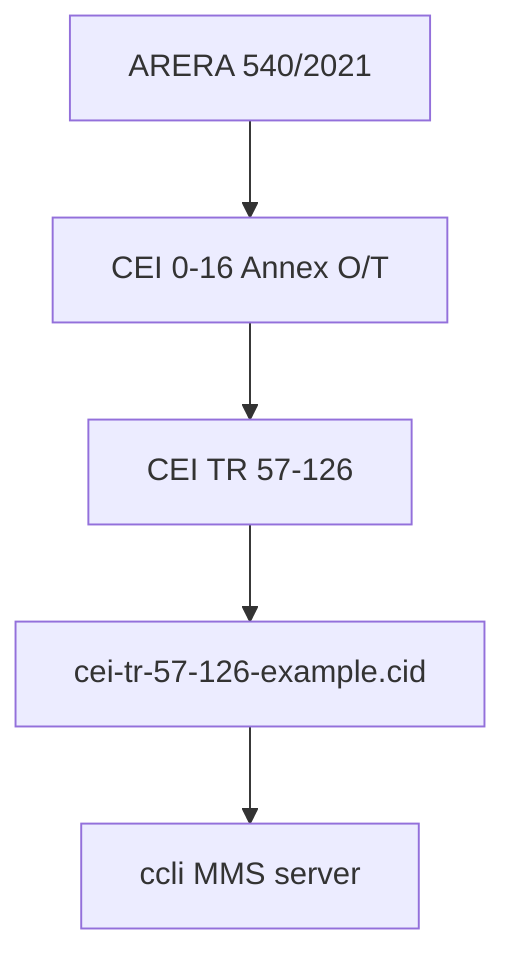

# CEI TR 57-126 — SCL/CID Example Extract (English)

**Document ID:** CCLI-GRID-TR-57-126-001  
**Revision:** 1.0  
**Date:** 2026-09-16  
**RAG source_id:** `cei-tr-57-126`  
**Normative source:** CEI TR 57-126 (CT 57) — *Example of SCL file for IEC 61850 communication of the CCI according to CEI 0-16 Annex T*  
**On-disk PDF:** [`../07-protocols/cei-tr-57-126.pdf`](../07-protocols/cei-tr-57-126.pdf) (34 pages; CEI edition 2024-11, effective 2022-11-01)  
**English raw text:** `Architecture/_extracted_reg_analysis/cei_tr_57-126_en.txt`  
**Example CID (Annex A):** `apps/ccli/config/icd/cei-tr-57-126-example.cid`  
**Companion:** `CCI_Annex_T_Extract.md` · `CCI_CEI_0-16_Consolidated.md`  
**Programme link:** K4.3 · K7.2 · REQ-61850-001

---

## Summary

CEI **TR 57-126** is a **non-normative Technical Report** (CT 57) that provides a **concrete Configured IED Description (CID)** implementing Annex T of CEI 0-16. It covers **PF1 (Observability — mandatory)** and **PF2 (Controllability — optional)** functional performances, plus reporting/DataSet conventions not spelled out in detail in Annex T.

**Corpus status:** **HAVE (English)** — PDF ingested, engineering extract, Annex A CID extracted to `config/icd/`.

**CPC vs CCI:** The TR uses *Central Plant Controller (CPC)*; CEI 0-16 and this programme use *CCI* — same role (IEC 61850 Server at the plant delivery point).

---

## Requirements (mapped to CCLI programme)

| ID | Requirement | Source | CCLI implication |
|----|-------------|--------|------------------|
| REQ-TR57-001 | Single logical device **`LD_Plant`** hosts all mandatory and optional LNs | §5.2 | One MMS server LD; no multi-LD split |
| REQ-TR57-002 | IED name assigned per DSO/plant convention; unique for DSO client | §5.1 | Runtime/config override of example `CCI016_01` |
| REQ-TR57-003 | Static IP (or DSO DHCP) in `<Communication>` | §5.3.1 | Eth_A addressing plan from DSO |
| REQ-TR57-004 | DataSet prefix **`DS_R_`**; buffered RCB prefix **`brcb_`**; unbuffered **`urcb_`** | §5.3.2.1 | Match libiec61850 report naming |
| REQ-TR57-005 | PoC measurements: **`urcb_*`** with **`intgPd="4000"`** (4 s) | Annex A + §5.3.2.1 | Aligns with Annex O PF1 / Annex T T.3.2.1 |
| REQ-TR57-006 | Status/alarms: **`brcb_*`** with dchg/qchg/gi triggers | §5.3.2.1 | Buffered report for DG/switch/FR status |
| REQ-TR57-007 | SGG instances **N (1..99)** paired: `SGG`/`SSGG` same `lnInst` | §5.2.1.4–5 | Per-unit P + GnGrId consistency |
| REQ-TR57-008 | All six PF2 adjustment functions modeled; DSO enables subset | §5.2.2 | Instantiate LNs; expose only enabled FRs |
| REQ-TR57-009 | Control operations: **SBO with enhanced security** on sensitive DOs | §5.3.3, Annex A | Phase 3 MMS + 62351-4 TLS |
| REQ-TR57-010 | Configurator fills plant-specific: vendor, swRev, POD, power polygon, SGG count | §5.2.1 | Product commissioning workflow |

---

## Architecture

### Document role in stack



Annex T defines **what** (LN classes, DOs, timing, cyber). TR 57-126 defines **how to instantiate** one reference plant in SCL.

### Data model (example CID)

| Element | Example value | Notes |
|---------|---------------|-------|
| IED name | `CCI016_01` | Replace per DSO agreement |
| Access point | `accessPoint1` | Single MMS server |
| Logical device | `LD_Plant` | All LNs in one LD |
| PoC measurements | `PdC/MMXU1` — TotW, TotVAr, PPV, A | 4 s periodic report |
| Source aggregates | `GenPV`, `GenTer`, `GenIdr`, `St` MMXU | Include only installed sources |
| Single gen groups | `SGG/MMXU` + `SSGG/DGEN` inst 1..N | Example: GenPV(1) id=1, GenTer(1) id=2 |
| DG switch | `IDG/XCBR1.Pos` | In status DataSet |
| PF2 functions | `Wlim`, `WSd`, `VArSd`, `PFSP`, `VArV` (+ DPMC/DECP), `PFW` | Example: only **WSd** active |

### Reporting (Annex A conventions)

| DataSet | Report control | Type | Period / triggers |
|---------|----------------|------|-------------------|
| `DS_R_Stato_Allarmi_Segnali` | `brcb_Stato_Allarmi_Segnali` | Buffered | dchg, qchg, GI |
| `DS_R_PdC_Mis4sec` | `urcb_PdC_Mis4sec` | Unbuffered | 4000 ms + GI |
| `DS_R_GenAcc_Mis4sec` | `urcb_GenAcc_Mis4sec` | Unbuffered | 4000 ms + GI |
| `DS_R_SingGen_Mis4sec` | `urcb_SingGen_Mis4sec` | Unbuffered | 4000 ms + GI |

Italian names in the official CID (`Stato_Allarmi_Segnali`, `PdC`, …) differ slightly from the English prose in §5.3.2.1 (`Status_Alarms_Signals`, `CP`) — semantically equivalent.

### Reference use case (Chapter 6)

Example plant for the bundled CID:

- **PF1:** 2× PV (one SGG-sized), 2× thermo (one SGG-sized), hydro, storage, PoC measurements; DG switch position; no wind.
- **PF2:** Plant/generation/storage regulation **available**; only **active-power modulation at PoC (WSd)** enabled in Table 1 — other FRs present but inactive (`Beh`/`Mod` = off).

Example commissioning parameters (Table 1): IP `192.168.8.167/24`, gateway `192.168.8.1`, POD `IT000E123456789`, Pmax 200 kW, WSd setpoint default 20 % of Smax.

---

## Interface matrix

| Interface | Source | Destination | Protocol |
|-----------|--------|-------------|----------|
| DSO observability | CCI (CPC server) | DSO IEC 61850 client | MMS reports (4 s + spontaneous) |
| DSO control | DSO client | CCI server | MMS SBOw / write (PF2 setpoints) |
| Plant internal | Field devices / meters | CCI | **Out of scope** for TR 57-126 |
| SCL engineering | Configurator / OEM | CID file | IEC 61850-6 — `ccli-61850-6-extract` |

---

## BOM matrix

| Block | Function | Candidate / PN | Status |
|-------|----------|----------------|--------|
| MMS stack | Server, reports, control | libiec61850 | **HAVE** (GitHub ref) |
| CID baseline | Annex T data model | `cei-tr-57-126-example.cid` | **HAVE** |
| TLS / RBAC | Annex T cyber | IEC 62351-4 extract | **PART** (extract only) |
| DSO-specific ICD | Local naming / IP | DSO workbook | **MISSING** (per-DSO) |

---

## Knowledge gaps

| Area | Current | Required | Gap |
|------|---------|----------|-----|
| DSO workbook | TR 57-126 generic example | Per-DSO IED name, IP, enabled FR list | **MISSING** |
| V5 consolidated alignment | TR cites CEI 0-16:2022-03 / V3 | Cross-check vs 2025-12 Allegato T tables | **REVIEW** |
| GOOSE | Services declared in CID | Annex T optional subscribe | Not exercised in example |
| `signal_map.yaml` | — | Annex O events → MMS/DI/Modbus | **MISSING** |
| 61850-6 SCL grammar | Batch A only | §9 element tables (B–H) | **PART** — see `ccli-61850-6-extract` |
| XSD validation | Well-formed XML | Full SCL schema + libiec61850 load test | **TODO** |

---

## Risks

| ID | Description | Impact | Mitigation |
|----|-------------|--------|------------|
| R-TR57-001 | PDF→CID extraction artefacts | Invalid SCL at DSO acceptance | Script `extract-cei-tr-57-126.py` + XML parse; libiec61850 load test |
| R-TR57-002 | Example plant ≠ real plant | Wrong LN instances / DataSets | Parameterize SGG count, sources, FR enablement |
| R-TR57-003 | DSO may require different naming | Interop failure | Treat TR CID as **reference**, not production freeze |
| R-TR57-004 | TR edition 2022 vs CEI 0-16 V5 2025 | Semantic drift | Diff Allegato T tables vs CID lnNs `(Tr)IEC 61850-CEI016:2022` |

---

## Verification

| Requirement | Test | Pass criteria |
|-------------|------|---------------|
| REQ-TR57-001 | Parse CID | Exactly one `LDevice inst="LD_Plant"` |
| REQ-TR57-005 | Inspect `urcb_PdC_Mis4sec` | `intgPd="4000"` |
| REQ-TR57-006 | Inspect `brcb_Stato_Allarmi_Segnali` | `buffered="true"`, dchg+qchg+gi |
| REQ-TR57-009 | Scan ctlModel values | `sbo-with-enhanced-security` on control DOs |
| Corpus | File presence | PDF + extract + CID on disk |
| Runtime (Phase 3) | libiec61850 load CID | Server starts; GI returns PoC TotW |

---

## Extraction notes

- Annex A SCL recovered from PDF text via `scripts/extract-cei-tr-57-126.py` (repairs spaced tag artefacts such as `<V al >`).
- Re-run after any PDF re-ingest: `python scripts/extract-cei-tr-57-126.py`
- Source PDF also kept at repo root: `CEI TR 57-126.pdf` (user drop); canonical copy under `knowledge-base/07-protocols/`.

---

## RAG routing

Add to **Pack A — Italian CCI mandate**:

```
cei-tr-57-126, cei-0-16-allegato-t, cei-0-16-allegato-o
```

For ICD / MMS implementation queries, prefer **`cei-tr-57-126`** + **`cei-0-16-allegato-t`** together.
